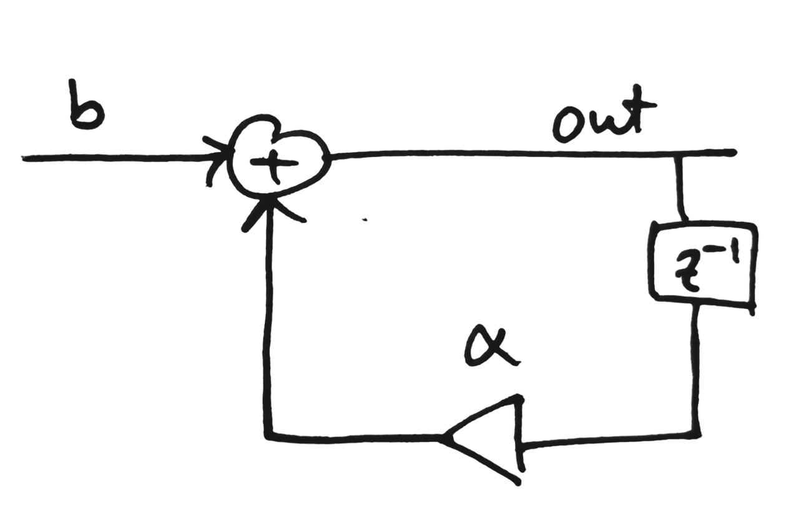

We would like to inject a probability distribution at $b$ and observe the output PDF at $out$ in the following system:

<center>

</center>

To approximate the PDF at $b$, we can generate 100,000 numbers from a uniform distribution. These 100,000 samples are then propagated through the system according to this code:

```python
for i in range(iters):
	b = np.random.uniform(low=-1, high=1, size=size)
    if(i - 1 < 0):
        out_d = np.zeros(size)
    else:
        out_d = out[i-1]
    
    out_dc = alpha * out_d
    out[i] = b + out_dc
```

The issue here is, at each iteration of the loop, $b$ takes values from a new independent uniform random variable. Therefore, the PC expansion at the output looks like:

| Iteration | PCE                                                | Variance $= E[PCE^2]$|
|-----------|:--------------------------------------------------:|----------------------|
|    0      |  $x_1$                                             | $E[{x_1}^2] = \frac{1}{3}$
|    1      |  $x_2 + \alpha(x_1)$                               | $E[{\alpha}^2{x_1}^2 + 2\alpha{x_2}{x_1} + {x_1}^2] = {\frac{1}{3}}({\alpha}^2)$
|    2      |  $x_3 + \alpha(x_2 + \alpha(x_1))$                 | $E[{\alpha}^4{x_1}^2 + 2{\alpha^3}{x_1}{x_2} + {\alpha}^2{x_2}^2 + 2{\alpha^2}{x_1}{x_3} + {x_3}^2] = {\frac{1}{3}}({\alpha}^4 + {\alpha}^2)$
|    3      |  $x_4 + \alpha(x_3 + \alpha(x_2 + \alpha(x_1)))$   | ${\frac{1}{3}}({\alpha}^6 + {\alpha}^4 + {\alpha}^2)$
|    ...    | ...                                                | ${\frac{1}{3}}({\alpha}^8 + {\alpha}^6 + {\alpha}^4 + {\alpha}^2)$

However, if generate the PDF at $b$ as:


```python
b = np.random.uniform(low=-1, high=1, size=size)
for i in range(iters):
    if(i - 1 < 0):
        out_d = np.zeros(size)
    else:
        out_d = out[i-1]
    
    out_dc = alpha * out_d
    out[i] = b + out_dc
```

Then the output PC expansions look like:

| Iteration | PCE                                        | Variance $= E[PCE^2]$|
|-----------|:------------------------------------------:|----------------------|
|    0      |  $x$                                       | ${x}^2 = \frac{1}{3}$
|    1      |  $x + \alpha(x)$                           | ${(1+\alpha)}^2{x}^2 = {\frac{1}{3}}{(1+\alpha)}^2$
|    2      |  $x + \alpha(x + \alpha(x))$               | ${\frac{1}{3}}{(1+\alpha + {\alpha}^2)}^2$
|    3      |  $x + \alpha(x + \alpha(x + \alpha(x)))$   | ${\frac{1}{3}}{(1+\alpha + {\alpha}^2 + {\alpha}^3)}^2$
|    ...    | ...                                        | $...$


For First case
$$
Variance = \frac{1}{3} \cdot \frac{1}{1 - {\alpha}^2}
$$

For Second case
$$
Variance = \frac{1}{3} \cdot {(\frac{1}{1 - \alpha})}^2
$$